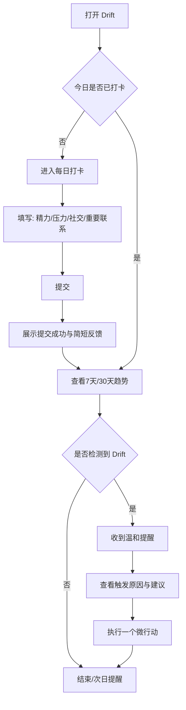
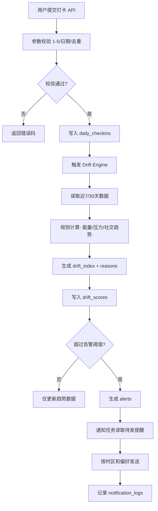
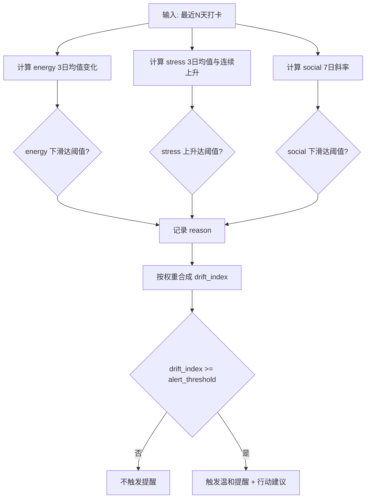

# Drift 产品流程图

## 1. 用户主流程（MVP）

```mermaid
flowchart TD
    A[打开 Drift] --> B{今日是否已打卡}
    B -- 否 --> C[进入每日打卡]
    C --> D[填写: 精力/压力/社交/重要联系]
    D --> E[提交]
    E --> F[展示提交成功与简短反馈]
    F --> G[查看7天/30天趋势]
    G --> H{是否检测到 Drift}
    H -- 否 --> I[结束/次日提醒]
    H -- 是 --> J[收到温和提醒]
    J --> K[查看触发原因与建议]
    K --> L[执行一个微行动]
    L --> I

    B -- 是 --> G
```

## 2. 系统处理流程（MVP）

```mermaid
flowchart TD
    A[用户提交打卡 API] --> B[参数校验 1-5/日期/去重]
    B --> C{校验通过?}
    C -- 否 --> D[返回错误码]
    C -- 是 --> E[写入 daily_checkins]
    E --> F[触发 Drift Engine]
    F --> G[读取近7/30天数据]
    G --> H[规则计算: 能量/压力/社交趋势]
    H --> I[生成 drift_index + reasons]
    I --> J[写入 drift_scores]
    J --> K{超过告警阈值?}
    K -- 否 --> L[仅更新趋势数据]
    K -- 是 --> M[生成 alerts]
    M --> N[通知任务读取待发提醒]
    N --> O[按时区和偏好发送]
    O --> P[记录 notification_logs]
```

## 3. Drift 检测决策流程（规则版）

```mermaid
flowchart TD
    A[输入: 最近N天打卡] --> B[计算 energy 3日均值变化]
    A --> C[计算 stress 3日均值与连续上升]
    A --> D[计算 social 7日斜率]

    B --> E{energy 下滑达阈值?}
    C --> F{stress 上升达阈值?}
    D --> G{social 下滑达阈值?}

    E --> H[记录 reason]
    F --> H
    G --> H

    H --> I[按权重合成 drift_index]
    I --> J{drift_index >= alert_threshold}
    J -- 否 --> K[不触发提醒]
    J -- 是 --> L[触发温和提醒 + 行动建议]
```
