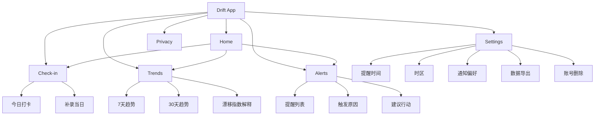
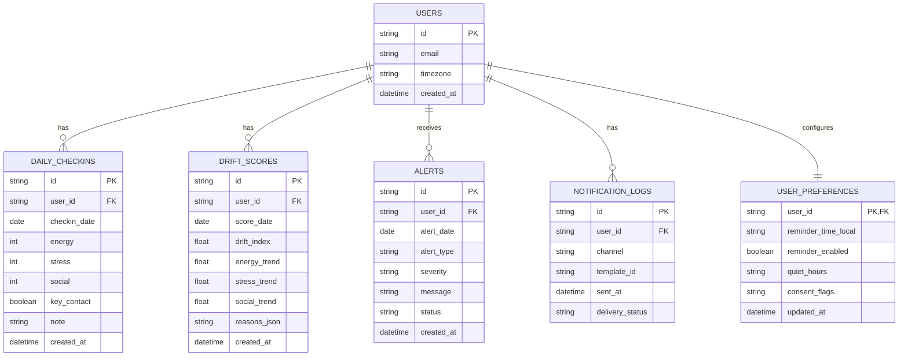

# Drift 信息架构与数据模型图

## 1. 信息架构图（IA）

## 2. 数据实体关系图（ER）

## 3. 约束说明
- `DAILY_CHECKINS` 建议唯一键：`(user_id, checkin_date)`。
- `DAILY_CHECKINS`、`DRIFT_SCORES` 建议索引：`(user_id, checkin_date/score_date)`。
- 所有查询默认按 `user_id` 进行隔离（RLS 或应用层强校验）。
